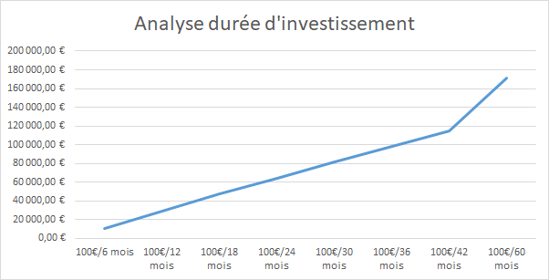

**Analyse des Résultats avec une durée d'investissement de 10 ans**

| Action     | Gain/Perte net | Gain/Perte net | Gain/Perte net | Gain/Perte net | Gain/Perte net | Gain/Perte net | Gain/Perte net | Gain/Perte net |
|------------|----------------|----------------|----------------|----------------|----------------|----------------|----------------|----------------|
| AC.PA      | 65,47 €        | 339,01 €       | 664,96 €       | 955,49 €       | 1 263,66 €     | 1 559,26 €     | 1 719,45 €     | 2 431,19 €     |
| ACA.PA     | 545,89 €       | 1 383,08 €     | 2 125,38 €     | 2 835,14 €     | 3 489,21 €     | 4 118,94 €     | 4 701,80 €     | 7 033,97 €     |
| AI.PA      | 146,96 €       | 416,13 €       | 786,53 €       | 1 192,89 €     | 1 545,49 €     | 1 988,35 €     | 2 480,36 €     | 4 102,46 €     |
| AIR.PA     | 744,64 €       | 1 412,30 €     | 1 707,00 €     | 1 956,09 €     | 2 527,58 €     | 3 216,75 €     | 3 441,10 €     | 4 492,20 €     |
| BN.PA      | 110,54 €       | 379,26 €       | 637,31 €       | 907,17 €       | 1 314,22 €     | 1 558,49 €     | 1 824,49 €     | 2 319,67 €     |
| BNP.PA     | 345,28 €       | 905,57 €       | 1 453,90 €     | 1 949,90 €     | 2 420,87 €     | 2 791,52 €     | 3 187,86 €     | 5 057,38 €     |
| BVI.PA     | 138,18 €       | 511,88 €       | 870,51 €       | 1 239,68 €     | 1 596,06 €     | 1 872,58 €     | 2 145,00 €     | 3 084,44 €     |
| CA.PA      | -387,26 €      | -553,13 €      | -641,63 €      | -708,72 €      | -749,34 €      | -726,64 €      | -711,63 €      | -644,69 €      |
| CAP.PA     | 237,58 €       | 624,67 €       | 1 158,32 €     | 1 638,04 €     | 2 089,63 €     | 2 518,88 €     | 2 848,73 €     | 4 200,35 €     |
| CS.PA      | 518,21 €       | 1 238,94 €     | 1 911,40 €     | 2 696,67 €     | 3 487,02 €     | 4 254,26 €     | 5 000,82 €     | 7 651,70 €     |
| DG.PA      | 415,13 €       | 887,92 €       | 1 334,24 €     | 1 801,49 €     | 2 312,96 €     | 2 728,31 €     | 3 060,28 €     | 3 989,17 €     |
| DSY.PA     | 271,02 €       | 821,81 €       | 1 353,05 €     | 1 879,16 €     | 2 504,77 €     | 3 159,72 €     | 3 689,16 €     | 4 875,80 €     |
| EDEN.PA    | 50,30 €        | 589,64 €       | 1 213,86 €     | 1 757,99 €     | 2 342,18 €     | 2 860,49 €     | 3 275,94 €     | 3 523,05 €     |
| EL.PA      | 271,23 €       | 291,84 €       | 356,56 €       | 591,00 €       | 744,99 €       | 906,98 €       | 1 121,48 €     | 2 387,86 €     |
| EN.PA      | 250,71 €       | 677,25 €       | 1 062,27 €     | 1 497,47 €     | 1 841,00 €     | 2 133,50 €     | 2 361,79 €     | 3 431,45 €     |
| ENGI.PA    | 298,53 €       | 931,78 €       | 1 620,61 €     | 2 366,27 €     | 3 214,98 €     | 4 029,49 €     | 4 815,38 €     | 7 392,59 €     |
| ERF.PA     | 516,14 €       | 1 133,16 €     | 1 899,82 €     | 2 491,49 €     | 2 863,06 €     | 2 911,42 €     | 2 978,13 €     | 4 039,27 €     |
| GLE.PA     | 706,39 €       | 1 734,83 €     | 2 558,18 €     | 3 449,10 €     | 4 271,70 €     | 4 998,24 €     | 5 714,66 €     | 9 825,38 €     |
| HO.PA      | 337,41 €       | 786,48 €       | 1 299,52 €     | 1 760,77 €     | 2 163,10 €     | 2 669,11 €     | 3 671,10 €     | 6 124,47 €     |
| KER.PA     | 0,00 €         | 0,00 €         | 0,00 €         | 0,00 €         | 0,00 €         | 0,00 €         | 0,00 €         | 0,00 €         |
| LR.PA      | 372,19 €       | 877,17 €       | 1 512,72 €     | 2 092,40 €     | 2 690,95 €     | 3 237,87 €     | 3 665,98 €     | 5 546,49 €     |
| MC.PA      | 0,00 €         | 0,00 €         | 0,00 €         | 0,00 €         | 0,00 €         | 0,00 €         | 0,00 €         | 0,00 €         |
| ML.PA      | 187,38 €       | 623,00 €       | 1 017,03 €     | 1 264,69 €     | 1 443,97 €     | 1 571,66 €     | 1 710,50 €     | 2 473,64 €     |
| MT.AS      | 295,97 €       | 1 003,93 €     | 1 536,96 €     | 1 870,65 €     | 2 153,69 €     | 2 278,91 €     | 2 377,96 €     | 3 664,02 €     |
| OR.PA      | 0,00 €         | 0,00 €         | 0,00 €         | 0,00 €         | 0,00 €         | 0,00 €         | 0,00 €         | 0,00 €         |
| ORA.PA     | 130,06 €       | 510,92 €       | 856,44 €       | 1 252,68 €     | 1 626,81 €     | 2 012,67 €     | 2 372,94 €     | 3 493,78 €     |
| PUB.PA     | 257,53 €       | 822,82 €       | 1 379,74 €     | 1 812,00 €     | 2 492,98 €     | 3 183,10 €     | 4 043,69 €     | 6 016,42 €     |
| RI.PA      | 21,97 €        | 222,53 €       | 481,10 €       | 794,42 €       | 1 036,90 €     | 1 189,28 €     | 1 316,93 €     | 2 013,83 €     |
| RMS.PA     | 0,00 €         | 0,00 €         | 0,00 €         | 0,00 €         | 0,00 €         | 0,00 €         | 0,00 €         | 0,00 €         |
| RNO.PA     | -140,86 €      | -70,25 €       | -223,60 €      | -276,24 €      | -237,27 €      | -267,05 €      | -459,62 €      | -740,88 €      |
| SAF.PA     | 529,32 €       | 1 043,79 €     | 1 584,91 €     | 1 992,13 €     | 2 529,72 €     | 3 124,35 €     | 3 719,33 €     | 4 624,07 €     |
| SAN.PA     | 41,28 €        | 260,31 €       | 475,14 €       | 692,81 €       | 918,74 €       | 1 099,25 €     | 1 372,12 €     | 1 970,03 €     |
| SGO.PA     | 417,59 €       | 1 245,35 €     | 1 953,83 €     | 2 594,19 €     | 3 078,21 €     | 3 579,93 €     | 4 057,10 €     | 7 142,64 €     |
| STLAP.PA   | 1 074,93 €     | 2 623,98 €     | 3 962,76 €     | 5 155,23 €     | 6 609,50 €     | 8 530,00 €     | 10 786,43 €    | 14 158,49 €    |
| STMPA.PA   | 930,84 €       | 2 423,20 €     | 4 090,13 €     | 5 513,87 €     | 6 241,10 €     | 6 968,04 €     | 7 793,44 €     | 12 325,97 €    |
| SU.PA      | 284,80 €       | 857,22 €       | 1 500,17 €     | 1 935,37 €     | 2 403,26 €     | 2 983,41 €     | 3 855,58 €     | 7 329,51 €     |
| TEP.PA     | 37,11 €        | 214,27 €       | 529,57 €       | 929,33 €       | 1 445,58 €     | 1 955,58 €     | 2 699,11 €     | 5 426,81 €     |
| TTE.PA     | 261,50 €       | 820,19 €       | 1 428,30 €     | 2 047,95 €     | 2 577,77 €     | 3 064,27 €     | 3 490,73 €     | 4 438,81 €     |
| URW.PA     | 338,54 €       | 611,52 €       | 737,16 €       | 914,87 €       | 1 010,59 €     | 1 014,73 €     | 1 014,73 €     | 1 014,73 €     |
| VIE.PA     | 422,22 €       | 979,86 €       | 1 355,43 €     | 1 780,06 €     | 2 511,15 €     | 3 112,92 €     | 3 567,09 €     | 5 346,88 €     |
|------------|----------------|----------------|----------------|----------------|----------------|----------------|----------------|----------------|
| Total      | 11 044,72 €    | 29 582,23 €    | 47 549,58 €    | 64 623,50 €    | 81 776,79 €    | 98 188,57 €    | 114 709,94 €   | 171 562,95 €   |
| Analyse    | 100€/6 mois    | 100€/12 mois   | 100€/18 mois   | 100€/24 mois   | 100€/30 mois   | 100€/36 mois   | 100€/42 mois   | 100€/60 mois   |
|------------|----------------|----------------|----------------|----------------|----------------|----------------|----------------|----------------|
| Avec perte | 2              | 2              | 2              | 2              | 2              | 2              | 2              | 2              |
| Sans gain  | 4              | 4              | 4              | 4              | 4              | 4              | 4              | 4              |
| Avec gain  | 33             | 33             | 33             | 33             | 33             | 33             | 33             | 33             |

# Recommandations
## ✅ Points Positifs
    Performance exceptionnelle : +171 563 € sur 10 ans  
    Consistance remarquable : 33 actions sur 39 toujours performantes (85%)  
    Croissance régulière : Progression constante avec le temps  
    Résilience : Seulement 2 actions en perte constante (CA.PA, RNO.PA)  

## ⚠️ Actions à Problèmes
    CA.PA : Perte persistante (-645 € à 60 mois)  
    RNO.PA : Perte persistante (-741 € à 60 mois)  
    4 actions sans mouvement : KER.PA, MC.PA, OR.PA, RMS.PA (Prix supérieur à 100 € mise de base chaque mois)

## Taux de Réussite
    93% des positions : Rentables ou neutres  
    Seulement 5% : Positions perdantes structurelles  
    Exclure les underperformers : CA.PA et RNO.PA

# Conclusion Stratégique
La stratégie DCA sur le CAC40 reste extrêmement performante sur 2020-2025 :  
**✅ Avantages Confirmés**  
    Efficacité de la diversification  
    Effet temps déterminant  
    Robustesse face aux volatilités  

**🔄 Améliorations Possibles**  
    Exclusion sélective des 2 actions chroniquement perdantes  
    Réinvestissement des dividendes non capturé  
    Analyse sectorielle pour optimiser l'allocation  

Recommandation :  
    Maintenir la stratégie avec horizon 10 ans, en excluant CA.PA et RNO.PA pour améliorer encore la performance.

  
.
