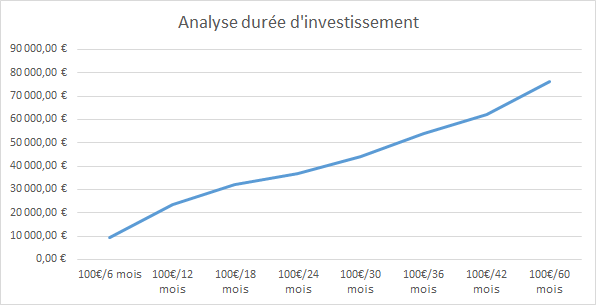

**Analyse des Résultats avec une durée d'investissement de 5 ans**

| Action     | Gain/Perte net | Gain/Perte net | Gain/Perte net | Gain/Perte net | Gain/Perte net | Gain/Perte net | Gain/Perte net | Gain/Perte net |
|------------|----------------|----------------|----------------|----------------|----------------|----------------|----------------|----------------|
| AC.PA      | 256,00 €       | 680,46 €       | 1 026,79 €     | 1 336,06 €     | 1 746,96 €     | 2 226,77 €     | 2 623,78 €     | 3 283,15 €     |
| ACA.PA     | 526,45 €       | 1 287,30 €     | 1 771,32 €     | 2 184,61 €     | 2 756,94 €     | 3 482,73 €     | 4 085,69 €     | 5 286,00 €     |
| AI.PA      | 87,58 €        | 109,13 €       | 177,52 €       | 228,40 €       | 219,73 €       | 383,18 €       | 497,18 €       | 694,70 €       |
| AIR.PA     | 350,62 €       | 562,69 €       | 621,73 €       | 626,36 €       | 934,00 €       | 1 249,19 €     | 1 455,53 €     | 2 261,42 €     |
| BN.PA      | 96,98 €        | 316,03 €       | 537,30 €       | 766,18 €       | 1 073,64 €     | 1 385,89 €     | 1 659,52 €     | 2 279,29 €     |
| BNP.PA     | 411,23 €       | 1 035,39 €     | 1 420,13 €     | 1 656,44 €     | 2 062,94 €     | 2 541,17 €     | 2 870,49 €     | 3 767,33 €     |
| BVI.PA     | 139,68 €       | 464,84 €       | 652,80 €       | 730,64 €       | 825,65 €       | 945,69 €       | 1 067,99 €     | 1 377,20 €     |
| CA.PA      | -9,87 €        | 114,17 €       | 193,94 €       | 225,39 €       | 147,57 €       | 140,40 €       | 51,88 €        | -76,83 €       |
| CAP.PA     | 152,41 €       | 368,88 €       | 592,20 €       | 502,73 €       | 431,48 €       | 458,81 €       | 526,21 €       | 330,07 €       |
| CS.PA      | 504,64 €       | 1 224,07 €     | 1 806,99 €     | 2 346,53 €     | 2 906,76 €     | 3 500,30 €     | 3 994,11 €     | 5 175,84 €     |
| DG.PA      | 204,50 €       | 443,09 €       | 637,07 €       | 866,06 €       | 1 100,46 €     | 1 327,23 €     | 1 471,99 €     | 1 778,28 €     |
| DSY.PA     | -131,72 €      | -126,94 €      | -242,48 €      | -592,31 €      | -835,61 €      | -952,78 €      | -1 090,24 €    | -1 692,26 €    |
| EDEN.PA    | -297,40 €      | -422,02 €      | -588,40 €      | -795,95 €      | -971,60 €      | -1 248,02 €    | -1 602,69 €    | -2 463,05 €    |
| EL.PA      | 41,66 €        | 133,80 €       | 180,12 €       | 164,96 €       | 163,73 €       | 197,02 €       | 223,15 €       | 548,99 €       |
| EN.PA      | 216,74 €       | 546,20 €       | 804,07 €       | 1 028,42 €     | 1 325,39 €     | 1 656,30 €     | 1 960,80 €     | 2 587,84 €     |
| ENGI.PA    | 443,38 €       | 1 090,55 €     | 1 733,57 €     | 2 412,37 €     | 3 123,65 €     | 3 868,25 €     | 4 519,99 €     | 6 189,72 €     |
| ERF.PA     | 191,34 €       | 314,34 €       | 376,99 €       | 78,84 €        | -201,65 €      | -263,31 €      | -321,70 €      | -258,87 €      |
| GLE.PA     | 892,07 €       | 2 237,80 €     | 3 173,71 €     | 3 959,19 €     | 4 929,59 €     | 5 952,55 €     | 6 863,84 €     | 10 883,97 €    |
| HO.PA      | 164,20 €       | 503,67 €       | 844,48 €       | 1 173,18 €     | 1 517,71 €     | 1 774,56 €     | 2 499,40 €     | 4 348,68 €     |
| KER.PA     | 0,00 €         | 0,00 €         | 0,00 €         | 0,00 €         | 0,00 €         | 0,00 €         | 0,00 €         | 0,00 €         |
| LR.PA      | 277,08 €       | 570,87 €       | 956,11 €       | 1 221,23 €     | 1 520,31 €     | 1 887,77 €     | 2 200,70 €     | 2 919,03 €     |
| MC.PA      | 0,00 €         | 0,00 €         | 0,00 €         | 0,00 €         | 0,00 €         | 0,00 €         | 0,00 €         | 0,00 €         |
| ML.PA      | 158,34 €       | 445,53 €       | 559,41 €       | 486,84 €       | 476,43 €       | 623,85 €       | 762,99 €       | 679,16 €       |
| MT.AS      | 825,78 €       | 1 894,40 €     | 2 316,93 €     | 2 399,40 €     | 2 526,33 €     | 2 819,78 €     | 2 933,49 €     | 3 970,11 €     |
| OR.PA      | 0,00 €         | 0,00 €         | 0,00 €         | 0,00 €         | 0,00 €         | 0,00 €         | 0,00 €         | 0,00 €         |
| ORA.PA     | 236,85 €       | 701,42 €       | 1 147,98 €     | 1 594,92 €     | 1 993,23 €     | 2 408,87 €     | 2 783,74 €     | 3 889,41 €     |
| PUB.PA     | 639,10 €       | 1 445,35 €     | 2 008,49 €     | 2 424,68 €     | 3 079,96 €     | 3 727,84 €     | 4 339,31 €     | 4 499,88 €     |
| RI.PA      | -52,65 €       | -52,17 €       | -52,17 €       | -52,17 €       | -52,17 €       | -52,17 €       | -52,17 €       | -52,17 €       |
| RMS.PA     | 0,00 €         | 0,00 €         | 0,00 €         | 0,00 €         | 0,00 €         | 0,00 €         | 0,00 €         | 0,00 €         |
| RNO.PA     | 288,42 €       | 643,61 €       | 651,12 €       | 774,52 €       | 1 083,56 €     | 1 276,98 €     | 1 299,06 €     | 1 226,60 €     |
| SAF.PA     | 276,43 €       | 444,14 €       | 559,14 €       | 701,25 €       | 1 036,46 €     | 1 432,64 €     | 1 909,58 €     | 2 782,86 €     |
| SAN.PA     | 19,65 €        | 147,99 €       | 264,06 €       | 352,43 €       | 396,30 €       | 460,70 €       | 490,62 €       | 499,28 €       |
| SGO.PA     | 556,09 €       | 1 321,55 €     | 1 799,61 €     | 2 015,51 €     | 2 260,28 €     | 2 830,59 €     | 3 270,51 €     | 4 362,22 €     |
| STLAP.PA   | 1 194,93 €     | 2 743,98 €     | 3 097,39 €     | 2 766,98 €     | 2 813,99 €     | 3 486,09 €     | 4 181,95 €     | 930,30 €       |
| STMPA.PA   | -4,49 €        | 9,97 €         | -57,55 €       | -264,97 €      | -481,48 €      | -510,69 €      | -862,50 €      | -1 914,33 €    |
| SU.PA      | 196,11 €       | 408,10 €       | 557,41 €       | 441,11 €       | 463,41 €       | 669,27 €       | 932,14 €       | 1 522,23 €     |
| TEP.PA     | -207,40 €      | -365,87 €      | -456,51 €      | -462,66 €      | -462,66 €      | -462,66 €      | -462,66 €      | -462,66 €      |
| TTE.PA     | 305,87 €       | 838,21 €       | 1 313,39 €     | 1 769,51 €     | 2 123,22 €     | 2 341,96 €     | 2 493,18 €     | 2 390,18 €     |
| URW.PA     | 338,54 €       | 611,52 €       | 737,16 €       | 914,87 €       | 1 010,59 €     | 1 014,73 €     | 1 014,73 €     | 1 014,73 €     |
| VIE.PA     | 229,50 €       | 658,43 €       | 917,02 €       | 1 012,24 €     | 1 155,84 €     | 1 432,98 €     | 1 568,03 €     | 1 783,95 €     |
|------------|----------------|----------------|----------------|----------------|----------------|----------------|----------------|----------------|
| Total      | 9 518,64 €     | 23 350,48 €    | 32 038,84 €    | 36 993,79 €    | 44 200,94 €    | 54 014,46 €    | 62 159,62 €    | 76 342,25 €    |
| Analyse    | 100€/6 mois    | 100€/12 mois   | 100€/18 mois   | 100€/24 mois   | 100€/30 mois   | 100€/36 mois   | 100€/42 mois   | 100€/60 mois   |
|------------|----------------|----------------|----------------|----------------|----------------|----------------|----------------|----------------|
| Avec perte | 6              | 4              | 5              | 5              | 6              | 6              | 6              | 7              |
| Sans gain  | 4              | 4              | 4              | 4              | 4              | 4              | 4              | 4              |
| Avec gain  | 30             | 32             | 31             | 31             | 30             | 30             | 30             | 29             |

# Performance Globale
    Tendance claire : Plus la durée d'investissement est longue, plus le gain total est important
    Progression significative : De 9 519 € (6 mois) à 76 342 € (60 mois) - une multiplication par 8
    Croissance régulière : La performance s'améliore continuellement avec le temps

# Durée d'Investissement Idéale
## La durée de 60 mois (5 ans) apparaît comme optimale car :
    Gain total le plus élevé (76 342 €)
    Performance cohérente sur la majorité des actions
    Meilleure résilience face aux fluctuations de marché
## Actions Performantes :
    Top performers : GLE.PA (+10 884 €), ENGIE.PA (+6 189 €), CS.PA (+5 175 €)
    Consistance : La plupart des actions montrent une progression régulière
    Secteurs porteurs : Banque (GLE.PA, BNP.PA), Énergie (ENGIE.PA), Luxe (CS.PA)
## Actions à Problèmes:
    Pertes persistantes : DSY.PA, EDEN.PA, TEP.PA, ERF.PA
    Actions sans gain : KER.PA, MC.PA, OR.PA, RMS.PA (4 actions stables)
    Risque décroissant : Seulement 7 actions en perte après 60 mois vs 6 après 6 mois

# Recommandations
## ✅ Points Positifs
    Diversification efficace : Seulement 15-20% des positions génèrent des pertes
    Effet temps : Le temps compense le risque de marché
    Approche systématique : Réduit le risque de timing market

## ⚠️ Points de Vigilance
    Sélection d'actions : Éviter les valeurs structurellement déficitaires
    Frais d'investissement : Impact non négligeable sur les petites positions
    Concentration sectorielle : Surveiller l'exposition aux secteurs cycliques

# Conclusion Stratégique
La stratégie DCA sur le CAC 40 est globalement rentable avec un horizon de 5 ans :  
    🔸 Risque modéré : 85-90% de chances de gain sur la période  
    🔸 Durée optimale : 60 mois pour maximiser les rendements, normal car on est sur un marché porteur depuis 5 ans  
    🔸 Approche recommandée : Maintenir la stratégie en évitant les actions chroniquement perdantes  

# Recommandation finale :
    Poursuivre le DCA en ciblant les 5 à 10 actions les plus performantes du CAC 40  
    avec un horizon de 3-5 ans pour optimiser le ratio risque/rendement  
  
.
